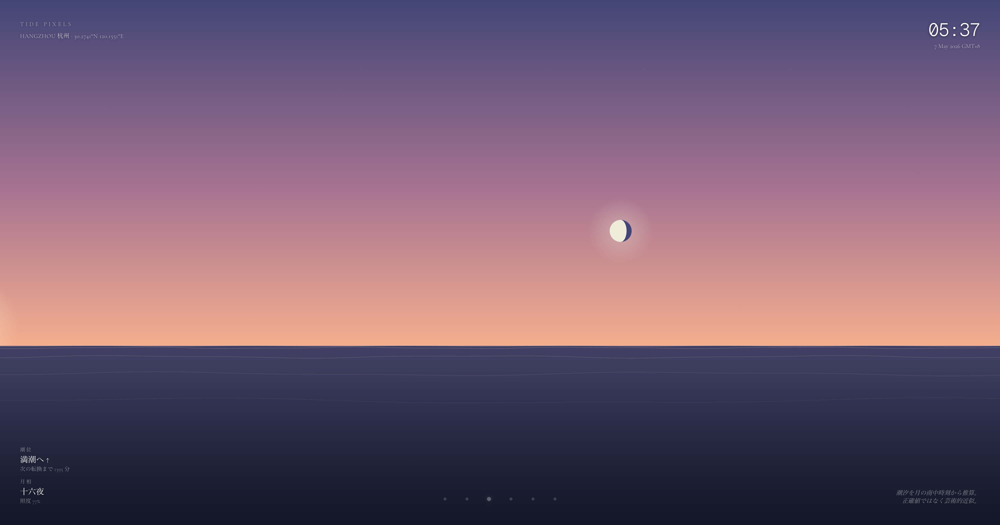
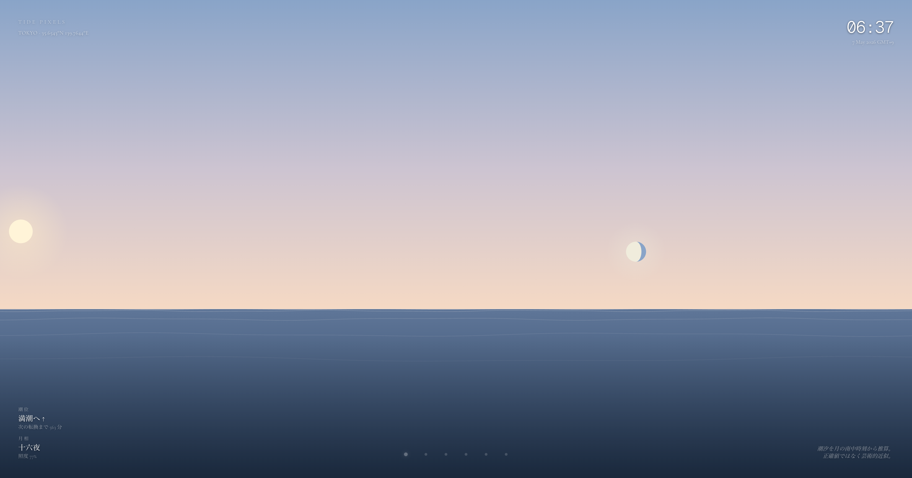
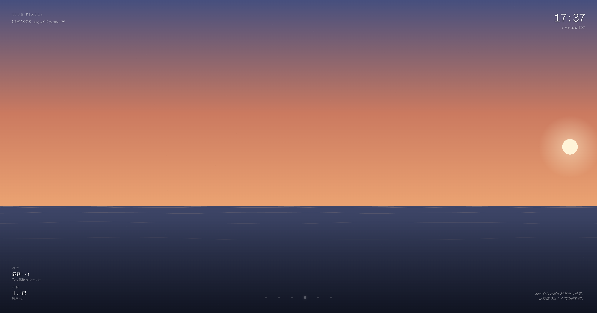

# Tide Pixels

A real-time ambient ocean canvas. The sky color, sun/moon position, moon phase, and tide direction are computed from your chosen city's actual time and lunar transit — every pixel is driven by SunCalc, not pre-rendered.

<p align="center">
  
  
  
</p>

<p align="center"><em>Same moment, three timezones — Hangzhou pre-dawn · Tokyo sunrise (sun and moon both up) · New York dusk.</em></p>

**Live**: [tide-pixels-2026-05-06.vercel.app](https://tide-pixels-2026-05-06.vercel.app)

Open it in a browser tab, or set it as a Mac desktop wallpaper via [Plash](https://sindresorhus.com/plash) and watch your cities' tides over the day.

---

## Six cities

| City | URL |
|---|---|
| Tokyo (default) | [`/`](https://tide-pixels-2026-05-06.vercel.app/) |
| Osaka | [`/?c=osaka`](https://tide-pixels-2026-05-06.vercel.app/?c=osaka) |
| Hangzhou 杭州 | [`/?c=hangzhou`](https://tide-pixels-2026-05-06.vercel.app/?c=hangzhou) |
| New York | [`/?c=nyc`](https://tide-pixels-2026-05-06.vercel.app/?c=nyc) |
| Reykjavík | [`/?c=reykjavik`](https://tide-pixels-2026-05-06.vercel.app/?c=reykjavik) |
| Sydney | [`/?c=sydney`](https://tide-pixels-2026-05-06.vercel.app/?c=sydney) |

Custom point: `/?lat=43.06&lng=141.35&label=Sapporo&tz=Asia/Tokyo`

The bottom dot row (right side on mobile) lets you switch between cities live.

---

## What's actually computed

- **Sky color** — interpolated across 10 keyframes through the day (deep night → dawn → noon → dusk), in the city's local timezone.
- **Sun & moon position** — `SunCalc.getPosition` + `getMoonPosition`. Mapped from azimuth/altitude onto the canvas, hidden when below the horizon.
- **Moon phase** — `SunCalc.getMoonIllumination`. Drawn as a half-disc + terminator ellipse, waxing right-lit / waning left-lit.
- **Tide** — approximated from the moon's upper/lower transit times (rise/set midpoint), interpolated as a `cos` wave between two consecutive peaks. Polar-region fallback uses a simple semi-diurnal sine.
- **Stars & meteors** — 60 deterministic stars seeded from a fixed RNG (so the field is stable across reloads). Fade in as `sun.altitude` drops below the horizon. A meteor spawns every 30–90 seconds during full night, fades in/out over ~1.2 s.

The art-piece label at the bottom-right says it: *"Tides estimated from lunar transit times — artistic approximation, not measured data."*

---

## Tech stack

- Next.js 16 (App Router, server components for `searchParams`)
- Tailwind v4
- Cormorant Garamond + Geist Mono (`next/font/google`)
- [`suncalc`](https://github.com/mourner/suncalc)
- Plain Canvas 2D + RAF — no external animation library

---

## Local dev

```bash
pnpm install
pnpm dev
```

Open <http://localhost:3000>.

```bash
pnpm build  # production build
```

---

## Used as a desktop wallpaper

1. Install [Plash](https://apps.apple.com/app/plash/id1494023538) (free, Mac App Store).
2. Plash menu bar → `Add Website…` → paste a city URL above.
3. Keep `Browsing Mode` off — Tide Pixels has no required interaction; switching cities happens via Plash's website list.

For multi-display: assign different cities per monitor (Tokyo on one, NYC on another) — the dusk/dawn contrast across timezones makes the screen feel alive.

---

## Elsewhere

- [Sky Traffic](https://github.com/Jada-Q/sky-traffic) — live aircraft trails over your city's airspace
- [Bay Ships](https://github.com/Jada-Q/bay-ships) — ship lanes through major harbors (procedural demo)
- [Subway Pulse](https://github.com/Jada-Q/subway-pulse) — Tokyo metro lines as Beck-style abstract diagram (procedural demo)
- [Quake Globe](https://github.com/Jada-Q/quake-globe) — live global earthquakes from USGS as ringing light pulses

---

## License

MIT — do whatever you want, but if you ship a paid product literally cloned from this, at least drop a thank-you somewhere.
